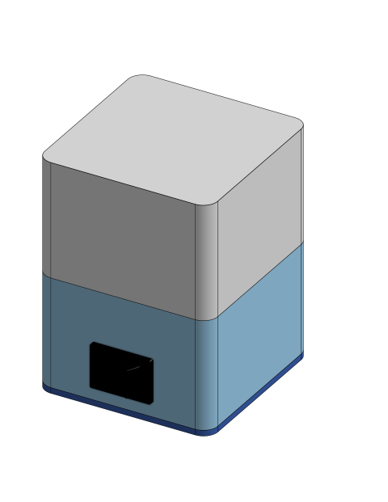

# Matrix Lamp

<!-- insert here the GIF of all demos -->

The matrix lamp is a companion desktop lamp. It can be single color warm lamp, a rainbow, connect to your wifi network so that you can change color with any browser.

**Steps:**
1. Assemble the matrix-lamp as per the [CAD](#full-assembly-cad) files.
2. Connect up the wires as per the [schematic](./design-files/schematic.pdf).
3. Upload the firmware of your choice.\
    3.1. Use the USB-C port of the microcontroller when uploading the code.\
    3.2. Follow the [upload guide](./upload-guide.pdf).\
    3.3. Slide the microntroller into the slot after the code is uploaded.

> [!Note]
> The matrix-lamp is based on [5x5_RGBLED-Matrix project](https://github.com/retrobuiltRyan/5x5_RGBLED-Matrix). Thank you [@retrobuiltRyan](https://github.com/retrobuiltRyan/).

## Firmware

All the available firmware projects are in the [arduino-ide-projects](./arduino-ide-projects/) directory.

| Project | Description | Demo GIF |
| --------| ----------- | -------- |
| [Matrix Single](./arduino-ide-projects/matrix_single/) | Switches on to warm light color | 
| [Matrix Rainbow](./arduino-ide-projects/matrix_rainbow) | Cycles through the color spectrum | 
| [Matrix Web](./arduino-ide-projects/matrix_web) | Connects to a WiFi network, and allows user to change the color on the webpage ([matrix.local](http://matrix.local/)) | 

## Design Files and BOM

| Part | Description | Source |
| --- | --- | --- |
| base | Base to mount all the electronics | 3D print. [OBJ File](./design-files/matrix-lamp-part%20-%20base.obj) |
| shade | Lamp shade to diffuse light | 3D print. [OBJ File](./design-files/matrix-lamp-part%20-%20shade.obj) |
| lid | Lid to cover the electronics | 3D print. [OBJ File](./design-files/matrix-lamp-part%20-%20lid.obj) |
| microcontroller | XIAO ESP32-C3 (or C6) | [Digikey](https://www.digikey.com/short/3bt85588) |
| LED Matrix | 5x5 RGB LED Matrix | [RetroBuiltRyan Project](https://github.com/retrobuiltRyan/5x5_RGBLED-Matrix) |
| Switch | Rocker switch for power | [Digikey](https://www.digikey.com/short/wc1jd2dm) |
| USB-C Port | USB-C port for power | [Aliexpress](https://www.aliexpress.us/item/3256805810676482.html) |

### Full Assembly CAD
* [STEP File](./design-files/matrix-lamp-assembly.step)
* [OBJ File](./design-files/matrix-lamp-assembly.obj)
* [OnShape Project](https://cad.onshape.com/documents/ccbcd276d17b7a3aea16cf35/w/f551c633ae805254842b7607/e/2aad4dd67dddd37e613fc1dc?renderMode=0&uiState=69e5a446e34603db8a7e0ebe)